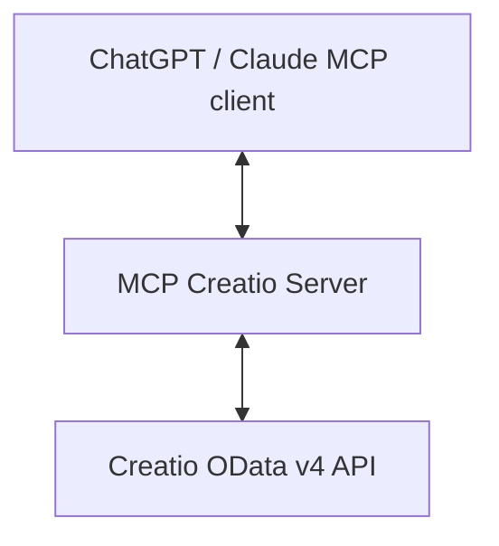

# MCP Creatio Server

## Overview

The **MCP Creatio Server** is a Model Context Protocol (MCP) provider that exposes **Creatio OData v4** as tools usable by **ChatGPT Connectors**, **Claude MCP apps**, or any MCP-compatible client.

It allows AI assistants to:

- Query Creatio records (`read`, `search`, `fetch`)
- Create, update, and delete entities (`create`, `update`, `delete`)
- Inspect the available schema (`list-entities`, `describe-entity`)
- Work directly with Creatio data in real time

This project is a scaffold: lightweight, easy to extend, and production-ready with minimal configuration.

---

## Features

- ✅ Full CRUD support for Creatio OData entities  
- ✅ Automatic schema discovery (`list-entities`, `describe-entity`)  
- ✅ OpenAI MCP compliance with **search** and **fetch** tools  
- ✅ Works with **ChatGPT Connectors** and **Claude Desktop MCP**  
- ✅ Simple configuration via environment variables  

---

## Architecture



- **MCP Server**: Registers tools and translates requests into OData calls  
- **Creatio OData Client**: Wraps HTTP requests to Creatio’s OData API  
- **Response Layer**: Returns JSON wrapped in MCP `content[]` format  

---

## Project Structure

- `src/server` — MCP server and tool definitions  
- `src/creatio` — OData client and adapter  
- `src/log` — logging utilities  
- `src/version.ts` — server name and version constants  
- `src/index.ts` — entrypoint  

---

## Environment Variables

| Variable            | Required | Description |
|---------------------|----------|-------------|
| `CREATIO_BASE_URL`  | ✅       | Base URL of your Creatio instance (e.g. `https://your-creatio.com`) |
| `CREATIO_LOGIN`     | ✅       | Username for Creatio Basic Auth |
| `CREATIO_PASSWORD`  | ✅       | Password for Creatio Basic Auth |
| `CREATIO_TOKEN`     | ❌       | Optional Bearer token (overrides login/password) |
| `PORT`              | ❌       | Port for MCP server (default: `3000`) |

---

## Installation & Run

Clone and install:

```bash
git clone https://github.com/your-org/mcp-creatio
cd mcp-creatio
npm install
```

Start the server:

```bash
npm run start
```

---

## MCP Tools

### 🔎 `read`
Read records from Creatio OData v4.  
- Required: `entity`  
- Optional: `filter`, `select`, `top`  

Example:
```json
{
  "entity": "Contact",
  "select": ["Id", "Name", "Email"],
  "top": 10
}
```

---

### ✏️ `create`
Create a new record.  
- Required: `entity`, `data`

Example:
```json
{
  "entity": "Account",
  "data": { "Name": "Acme Ltd", "Code": "ACM-001" }
}
```

---

### 🔄 `update`
Update an existing record.  
- Required: `entity`, `id`, `data`

Example:
```json
{
  "entity": "Contact",
  "id": "199a493b-ac55-4944-aece-0a4c1ea8da2f",
  "data": { "JobTitle": "CTO" }
}
```

---

### ❌ `delete`
Delete a record by Id.  
- Required: `entity`, `id`

Example:
```json
{
  "entity": "Contact",
  "id": "199a493b-ac55-4944-aece-0a4c1ea8da2f"
}
```

---

### 📋 `list-entities`
List all available entity sets.

---

### 🧩 `describe-entity`
Describe the schema of an entity set.  
- Required: `entitySet`

Example:
```json
{ "entitySet": "Contact" }
```

---

### 🔍 `search` (required by OpenAI MCP)
Lightweight search returning IDs, titles, and URLs.  
- Required: `query`

Example response:
```json
{
  "results": [
    {
      "id": "Contact:c4ed336c-3e9b-40fe-8b82-5632476472b4",
      "title": "Andrew Baker",
      "url": "https://your-creatio.com/Contact/c4ed336c"
    }
  ]
}
```

---

### 📥 `fetch` (required by OpenAI MCP)
Fetch a full document by ID.  
- Required: `id`

Example response:
```json
{
  "id": "Contact:c4ed336c-3e9b-40fe-8b82-5632476472b4",
  "title": "Andrew Baker",
  "text": "Full JSON record...",
  "url": "https://your-creatio.com/Contact/c4ed336c",
  "metadata": { "source": "Creatio OData" }
}
```

---

## Example Requests

cURL example (read 5 contacts):

```bash
curl -X POST http://localhost:3000/mcp/read   -H "Content-Type: application/json"   -d '{"entity":"Contact","top":5}'
```

PowerShell:

```powershell
Invoke-RestMethod -Method POST -Uri "http://localhost:3000/mcp/read" `
  -Body (@{ entity = 'Contact'; top = 5 } | ConvertTo-Json) `
  -ContentType 'application/json'
```

---

## Security Notes

- Do **not** commit credentials — always use environment variables.  
- Restrict access to trusted clients (firewall, reverse proxy, or API gateway).  
- Add request/response logging for debugging, but sanitize sensitive fields.  

---

## Roadmap

- [ ] Add pagination for `read` results  
- [ ] Support batch operations (bulk create/update)  
- [ ] Smarter `search` (fuzzy, multi-entity)  
- [ ] CI/CD with automated tests  

---

## Contributing

Contributions are welcome!  
Open an issue or PR to suggest improvements or report bugs.
